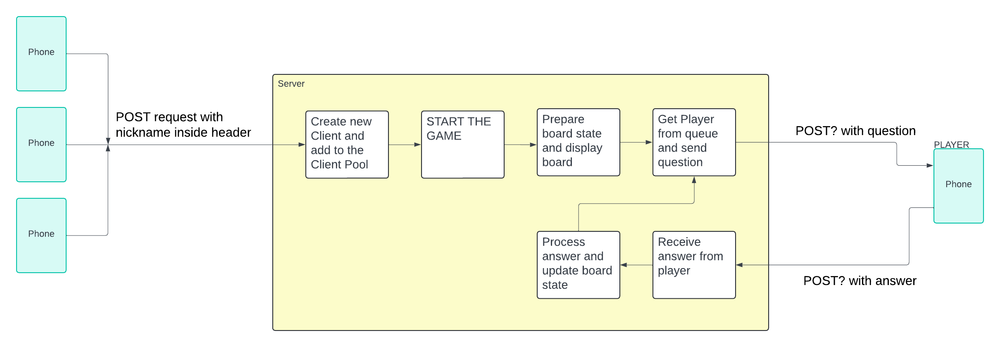

# Architecture

# Jak odpalić
* wejdź do folderu frontend 
* wpisz 'npm install'
* wpisz 'npm start'

# Jak odpalić ze spring bootem:
* pobierz i zbuduj projekt w swoim edytorze
* wszystkie potrzebne bilbioteki są w build.gradle
* uruchom plik BackendApplication.java
* no i g, u mnie działa pzdr

  
